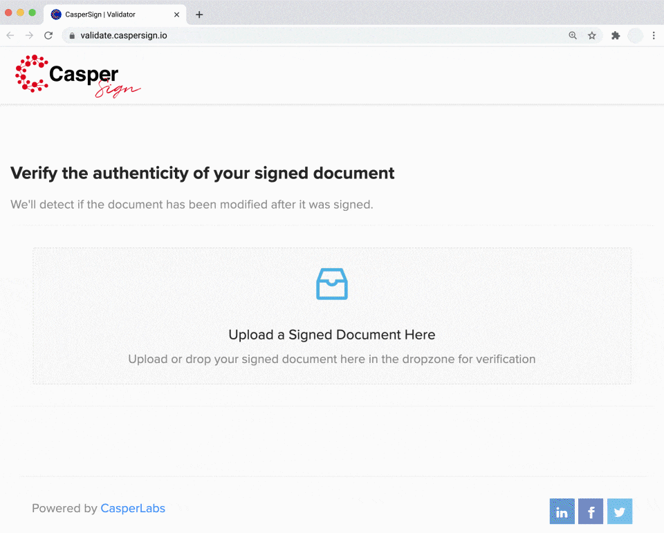

# caspersign-validator-ui

This is a part of the [CasperSign](https://blog.chronologic.network/caspersign-immutable-document-signatures-on-the-blockchain-65edc4969bf0) project.

This repository holds the UI for the document validator, where users can upload their documents and verify their validity.

The live version can be found [here](https://validate.caspersign.io/).

Featured as the "First Casper-Native Dapp" https://blog.casperlabs.io/the-first-casper-native-dapp-is-here-caspersign-allows-users-to-sign-contracts-confidentially-securely/

## :movie_camera: Demo

To experience validation, `in 10s you can demo validation of an existing signed PDF`.

1. Download in advance this [PDF](https://validate.caspersign.io/static/media/caspersign_example.26fc292b.pdf?download=1) here to your local hard drive/computer.
2. Drag and drop that PDF file onto https://validate.caspersign.io/ interface.

Alternatively simply bookmark real example signed document that contains various states of `HelloSign` and `CasperSign` signatures: https://validate.caspersign.io/?hash=799052832c12cd7ff82efa4a0d09766baad587ddc6b12174578e3af8f0e97099  
Transactions are verifiable on the blockchain: https://cspr.live/deploy/9e76497434403d0a55becdf5b0dfff6660170dd738675df48f502974a47f2841

## Project overview

The CasperSign project consists of the following repositories:

- https://github.com/chronologic/caspersign-app-ui
- https://github.com/chronologic/caspersign-validator-ui (this repository)
- https://github.com/chronologic/caspersign-signer-ui
- https://github.com/chronologic/caspersign-server
- https://github.com/chronologic/caspersign-contract

## 🔧 Environment variables

This repo uses [`dotenv`](https://www.npmjs.com/package/dotenv) to load environment variables.

For development, and `.env` file should be created based on the `.env.example` template file. The `.env` file should never be commited.

In production, environment variables can be injected directly.

Below is a list of possible environment variables.

| Name                | Type     | Default | Description                                                                            |
| ------------------- | -------- | ------- | -------------------------------------------------------------------------------------- |
| `REACT_APP_API_URL` | `string` |         | The URL pointing to [CasperSign API](https://github.com/chronologic/caspersign-server) |

## :construction: Building

Run `npm run build`.

## Development

Run `npm start`.
